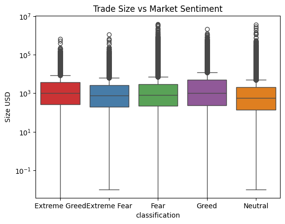
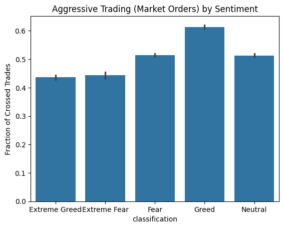
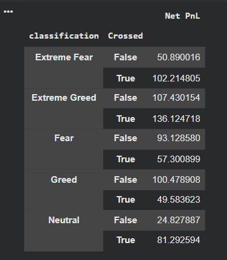
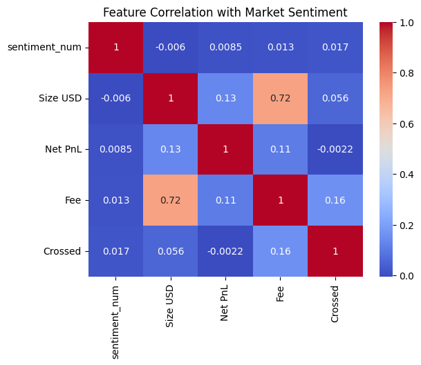

# 📊 Trader Performance vs Market Sentiment (Fear & Greed Index)

## 📌 Project Overview

This project analyzes the relationship between individual trader performance and overall market sentiment, using the Crypto Fear & Greed Index.
Instead of predicting prices, the focus is on understanding how sentiment influences trader behavior, execution style, risk, and profitability.

The analysis is performed at the per-trade level, preserving behavioral signals that are lost in heavy aggregation.

## 🔧 Data Preparation

- Converted timestamps to dates
- Merged trades with Fear & Greed data on date
- Removed non-informative columns (account IDs, hashes, etc.)
- Preserved per-trade granularity to avoid information loss
- Encoded sentiment ordinally for correlation analysis

## 📈 Key Analyses & Visualizations

### 1️⃣ Trade Size vs Market Sentiment

Neutral periods show smaller, more conservative trades

**📌 Insight:**

Traders increase position size as sentiment becomes optimistic.

### 2️⃣ Aggressive Trading (Market Orders) by Sentiment

Measured using the Crossed flag

**📌 Insight:**

Execution style adapts to sentiment — urgency rises during fear, patience during greed.

### 3️⃣ Win Rate by Market Sentiment

| Sentiment         | Win Rate (%) |
| ----------------- | ------------ |
| Extreme Fear      | ~38%         |
| Fear              | ~42%         |
| Neutral           | ~45%         |
| Greed             | ~42%         |
| **Extreme Greed** | **~56%**     |

**📌 Insight:**

Extreme Greed shows the highest win probability, likely due to trend continuation.

### 4️⃣ Risk-Adjusted Performance (Sharpe-like Ratio)

Mean(Net PnL) / Std(Net PnL)

| Sentiment         | Sharpe-like |
| ----------------- | ----------- |
| **Extreme Greed** | **Highest** |
| Neutral           | Moderate    |
| Fear              | Low         |
| Greed             | Low         |
| **Extreme Fear**  | **Lowest**  |

**📌 Insight:**

Extreme Greed provides the best risk-adjusted environment.
Extreme Fear is highly volatile and risky.

### 5️⃣ Loss Severity Analysis (Median Loss)

| Sentiment     | Median Loss  |
| ------------- | ------------ |
| Extreme Fear  | Largest      |
| Greed         | Large        |
| Fear          | Moderate     |
| Extreme Greed | Smaller      |
| **Neutral**   | **Smallest** |

**📌 Insight:**

Neutral sentiment minimizes downside risk and protects capital.

### 6️⃣ Execution Strategy × Sentiment (High-Value Finding)

Mean PnL & Win Rate split by execution type:

Market orders perform better in Fear & Neutral

Limit orders outperform in Greed & Extreme Greed

**📌 Insight:**

Extreme Fear resembles a high-variance gambling regime, while Extreme Greed offers consistent upside.

## 🔍 Correlation Analysis

Market sentiment shows weak linear correlation with Net PnL

Stronger relationships exist with:

- Trade size
- Execution aggressiveness
- Risk characteristics

**📌 Conclusion:**

Sentiment does not directly predict returns, but strongly influences trader behavior, which in turn affects outcomes.

## 🧠 Key Takeaways

- Market sentiment is best used as a behavioral filter, not a price predictor
- Extreme Greed is the most favorable regime for:
  - Risk-adjusted returns
  - Win rate
- Extreme Fear is the most dangerous due to:
  - High volatility
  - Large losses
- Execution strategy and position sizing should adapt dynamically to sentiment